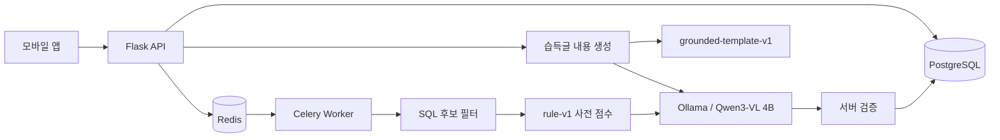

# LostLink AI Backend

학교와 행사장에서 작성된 분실글·습득글을 비교해 회수 가능성이 높은 후보를 추천하는 Flask 백엔드입니다. 이 `LLM` 브랜치는 AI 기능만 따로 떼어 실행 불가능한 샘플로 두지 않고, API·PostgreSQL·Redis·Celery와 함께 바로 검증할 수 있는 전체 백엔드를 포함합니다.

현재 사용 모델은 **Qwen3-VL 4B**이며 Ollama 모델 태그는 `qwen3-vl:4b`입니다. 모델은 두 가지 작업에 사용합니다.

1. 사용자가 입력한 객관적 사실로 습득글의 제목·특징·설명을 작성합니다.
2. 분실글과 습득글 후보를 비교해 항목별 매칭 점수와 이유를 만듭니다.

모델이 꺼져 있거나 응답이 잘못되어도 서비스가 중단되지 않습니다. 습득글 작성은 `grounded-template-v1`, 매칭은 `rule-v1`으로 자동 대체됩니다.

## 문서 안내

| 문서 | 내용 |
|---|---|
| [FOUND_POST_LLM_PLAN.md](docs/FOUND_POST_LLM_PLAN.md) | 습득글 LLM 자동 작성의 요구사항, 데이터 흐름, 검증 정책 |
| [API_SPEC.md](docs/API_SPEC.md) | REST API, 인증, Socket.IO, 에러 응답, 배포 명세 |
| [DTO_AND_SCHEMA_REFERENCE.md](docs/DTO_AND_SCHEMA_REFERENCE.md) | 모든 DTO 자료형과 PostgreSQL 컬럼 명세 |
| [LostLink.postman_collection.json](LostLink.postman_collection.json) | Postman Collection v2.1 |
| [har1.2.json](har1.2.json) | 앱 연동용 HTTP 요청 예시 |

## 기술 구성

| 영역 | 구성 |
|---|---|
| API | Python 3.12, Flask, Gunicorn |
| AI 런타임 | Ollama native `/api/chat` |
| AI 모델 | Qwen3-VL 4B (`qwen3-vl:4b`) |
| 인증 | Flask-JWT-Extended, Access/Refresh JWT |
| DB | PostgreSQL 16, SQLAlchemy, Alembic |
| 비동기 작업 | Celery, Redis |
| 실시간 채팅 | Flask-SocketIO, WebSocket, Redis message queue |
| 파일 | EC2 bind mount, Nginx `/uploads/` |
| 배포 | Docker Compose, GitHub Actions |

## AI 동작 구조



### 1. 습득글 자동 작성

`POST /api/v1/found-posts`에서 앱은 완성된 문장을 작성하지 않고 다음 정보를 보냅니다.

| 필드 | 필수 | LLM 전송 | 설명 |
|---|---:|---:|---|
| `category` | O | O | 공통 물건 카테고리 Enum |
| `color` | O | O | 대표 색상 |
| `location` | O | O | 발견 장소 |
| `foundAt` | O | O | 발견 시각, UTC ISO 8601로 정규화 |
| `observations` | X | O | 사용자가 직접 확인한 공개 특징, 최대 1,000자 |
| `storageLocation` | O | X | 실제 보관 위치 |
| `privateFeature` | X | X | 본인 확인용 비공개 특징 |
| `verificationQuestion` | X | X | 수령 검증 질문 |
| `imageUrl` | X | X | 업로드한 이미지 주소 |

서버는 전송 가능한 필드만 `sourceFacts` JSON으로 만들고 Qwen3-VL에 `title`, `features`, `description`을 요청합니다. 사용자 정보, 연락처, 보관 위치, 검증 정보, 이미지 URL·바이트는 모델에 보내지 않습니다.

Ollama 요청의 핵심 설정은 다음과 같습니다.

```json
{
  "model": "qwen3-vl:4b",
  "stream": false,
  "think": false,
  "format": {
    "type": "object",
    "properties": {
      "title": { "type": "string" },
      "features": { "type": "string" },
      "description": { "type": "string" }
    },
    "required": ["title", "features", "description"],
    "additionalProperties": false
  },
  "options": { "temperature": 0 }
}
```

모델 응답은 그대로 저장하지 않습니다. 서버가 다음 조건을 모두 검사합니다.

| 검증 | 기준 |
|---|---|
| JSON 구조 | `title`, `features`, `description`만 허용 |
| 문자열 길이 | 제목 100자, 특징·설명 각 2,000자 이하 |
| 핵심 사실 | 장소, 색상, 카테고리 표현이 결과에 포함되어야 함 |
| 숫자 근거 | 출력의 모든 숫자가 `sourceFacts`에도 존재해야 함 |
| 빈 값 | 세 필드 모두 비어 있지 않아야 함 |

타임아웃, HTTP 오류, JSON 파싱 오류, 스키마 위반, 근거 없는 내용이 발생하면 입력 사실만 조합하는 `grounded-template-v1` 결과를 저장합니다. 어떤 생성기가 사용됐는지는 응답의 `contentGeneration.generator`와 DB의 `content_generator`로 확인할 수 있습니다.

`category`, `color`, `location`, `foundAt`, `observations`를 수정하면 내용을 다시 생성합니다. AI가 관리하는 `title`, `features`, `description`을 직접 수정하면 `422 VALIDATION_FAILED`를 반환합니다.

### 2. 분실물 매칭

게시글 생성 또는 매칭에 영향을 주는 수정이 완료되면 Celery 작업을 큐에 넣습니다. 먼저 PostgreSQL에서 불가능한 후보를 제거합니다.

```sql
SELECT *
FROM found_posts
WHERE status = 'STORED'
  AND category = :lost_category
  AND user_id != :lost_author
  AND found_at >= :lost_at
ORDER BY found_at ASC
LIMIT :candidate_limit;
```

즉, 다른 사용자가 작성했고 같은 카테고리이며 분실 이후에 발견된 보관 중 물건만 AI 후보가 됩니다. 기본 후보 상한은 100개입니다.

각 후보에는 먼저 항상 재현 가능한 규칙 점수를 계산합니다.

| 항목 | 최대 점수 | 비교 방식 |
|---|---:|---|
| 카테고리 | 30 | Enum 일치 |
| 색상 | 15 | 정규화, 색상 동의어 그룹, 문자열 유사도 |
| 위치 | 20 | 정규화된 장소 문자열 유사도 |
| 시간 | 15 | 분실 시각과 발견 시각 차이 |
| 특징 | 20 | 특징·설명 문자열 유사도 |
| 합계 | 100 | 기본 저장 기준 50점 이상 |

Ollama가 활성화되면 Qwen3-VL이 공개 게시글 필드인 `id`, `category`, `color`, `location`, `occurredAt`, `features`, `description`만 비교합니다. `privateFeature`, 검증 질문, 사용자·연락처 정보는 보내지 않습니다.

매칭 요청도 `stream: false`, `think: false`, `temperature: 0`으로 호출합니다. 응답 후보 ID가 실제 후보 집합에 속하는지, 각 항목 점수가 최대치를 넘지 않는지, 이유가 5개·각 200자 이내인지 서버가 다시 검사합니다. 모델이 특정 후보를 누락하거나 해당 결과만 잘못 만들면 그 후보에는 미리 계산한 규칙 점수를 사용합니다. 호출 전체가 실패하면 모든 후보를 `rule-v1`으로 처리합니다.

기본 50점 이상인 후보만 `matches`에 저장하며, 사용한 방식은 `model_version`에 `ollama:qwen3-vl:4b` 또는 `rule-v1`로 기록합니다. 분석 작업은 실패 시 지수 백오프로 최대 3회 재시도합니다.

> 화면에 표시하는 점수는 정답 확률을 통계적으로 보정한 값이 아니라, 정의된 항목별 유사도 합계입니다. 발표할 때는 "매칭 가능성 점수"로 설명하는 것이 정확합니다.

## 이미지 처리 범위

이미지는 Base64로 전송하지 않습니다.

1. JWT와 함께 `POST /api/v1/uploads/images`를 호출합니다.
2. 요청 형식은 `multipart/form-data`, 파일 필드명은 `image`입니다.
3. 응답의 `/uploads/{fileName}` 주소를 게시글의 `imageUrl`에 넣습니다.
4. 서버는 주소만 DB에 저장하고 현재 AI 요청에는 이미지 URL이나 바이트를 포함하지 않습니다.

Qwen3-VL은 이미지 입력이 가능한 모델이지만, **현재 구현은 텍스트 JSON 전용**입니다. 따라서 사진 속 물건 종류·색상·스크래치 등을 모델이 분석한다고 설명하면 안 됩니다. VL 모델을 선택한 이유는 동일한 로컬 런타임에서 향후 이미지 비교를 확장할 수 있고, 현재 필요한 구조화 텍스트 생성·비교도 수행할 수 있기 때문입니다.

## 실행 방법

### 1. Ollama 준비

Ollama가 설치된 호스트에서 모델을 내려받고 서버를 실행합니다.

```bash
ollama pull qwen3-vl:4b
ollama serve
```

Docker Compose에는 Ollama 컨테이너가 포함되어 있지 않습니다. API·Worker 컨테이너가 접근 가능한 주소를 `OLLAMA_BASE_URL`로 지정해야 합니다. Ollama를 사용하지 않을 때는 `OLLAMA_ENABLED=false`로 실행할 수 있습니다.

### 2. 환경 변수

```bash
cp .env.example .env
```

`.env`에서 최소한 `SECRET_KEY`, `JWT_SECRET_KEY`, `POSTGRES_PASSWORD`를 안전한 값으로 변경합니다.

```dotenv
OLLAMA_ENABLED=true
OLLAMA_BASE_URL=http://host.docker.internal:11434
OLLAMA_MODEL=qwen3-vl:4b
OLLAMA_TIMEOUT_SECONDS=60
OLLAMA_CONTENT_TIMEOUT_SECONDS=20
MATCH_MIN_SCORE=50
```

Linux에서 Ollama가 다른 서버에 있다면 그 서버의 내부 IP와 포트를 사용합니다. 외부 Ollama 서비스에는 별도 API 키를 보내지 않으며, 현재 코드는 Ollama native `/api/chat`만 호출합니다.

### 3. 백엔드 실행

```bash
mkdir -p data/uploads
docker compose up -d --build
docker compose ps
curl http://127.0.0.1/healthz
curl http://127.0.0.1/api/v1/categories
```

Compose는 PostgreSQL, Redis, Flask API, Celery Worker, Nginx를 실행합니다. PostgreSQL 호스트 포트는 기본적으로 `127.0.0.1:5433`에만 바인딩됩니다.

## 요청 예시

회원가입은 앱 UI에서 제공하지 않고 Postman으로 시연 계정을 생성합니다. 로그인 후 받은 Access Token을 보호 API의 `Authorization: Bearer {accessToken}`에 넣습니다.

```http
POST /api/v1/found-posts
Authorization: Bearer {accessToken}
Content-Type: application/json
```

```json
{
  "category": "EARPHONE",
  "color": "BLACK",
  "location": "체육관 입구",
  "foundAt": "2026-07-13T14:20:00Z",
  "observations": "작은 흰색 스티커가 붙어 있음",
  "storageLocation": "학생회실",
  "privateFeature": "스티커 뒷면에 이니셜이 있음",
  "verificationQuestion": "스티커 뒷면의 이니셜은 무엇인가요?",
  "imageUrl": "/uploads/example.webp"
}
```

응답의 핵심 메타데이터는 다음과 같습니다.

```json
{
  "contentGeneration": {
    "generator": "ollama:qwen3-vl:4b",
    "sourceFields": ["category", "color", "location", "foundAt", "observations"]
  },
  "analysisQueued": true
}
```

Ollama가 비활성화되거나 검증을 통과하지 못하면 `generator`가 `grounded-template-v1`이 됩니다.

## 주요 파일

| 파일 | 책임 |
|---|---|
| `app/services/found_content.py` | source facts 구성, Qwen 습득글 생성, 응답 검증, 템플릿 폴백 |
| `app/services/llm.py` | Qwen 매칭 요청과 항목별 점수 검증 |
| `app/services/matching.py` | SQL 후보 필터, 규칙 점수, Match 저장 |
| `app/api/found_posts.py` | 습득글 생성·수정 API와 자동 생성 연동 |
| `app/tasks.py` | 분실글·습득글 Celery 분석 작업과 재시도 |
| `app/config.py` | Ollama, 타임아웃, 점수 기준 설정 |
| `app/models.py` | `FoundPost`, `LostPost`, `Match`와 생성기·모델 버전 컬럼 |
| `migrations/versions/f2d8c6a4e901_add_found_content_generation.py` | 원본 관찰 정보·생성기 컬럼 마이그레이션 |
| `tests/test_llm.py` | 모델 응답 검증과 폴백 단위 테스트 |
| `tests/test_api.py` | 습득글 자동 생성·재생성 API 통합 테스트 |

## API 요약

| Method | Endpoint | 권한 | 기능 |
|---|---|---|---|
| POST | `/api/v1/auth/signup` | 공개, Postman 설정용 | 시연 계정 생성 |
| POST | `/api/v1/auth/login` | 공개 | Access/Refresh JWT 발급 |
| GET | `/api/v1/categories` | 공개 | 공통 카테고리 목록 |
| POST/GET | `/api/v1/lost-posts` | 생성 JWT / 목록 공개 | 분실글 생성·조회 |
| POST/GET | `/api/v1/found-posts` | 생성 JWT / 목록 공개 | Qwen 기반 습득글 자동 작성·조회 |
| GET | `/api/v1/matches/lost-posts/{id}` | 분실글 작성자 | 매칭 후보 조회 |
| POST | `/api/v1/matches/{id}/claims` | 분실글 작성자 | 수령 요청·채팅방 생성 |
| PATCH | `/api/v1/matches/{id}/verify` | 습득글 작성자 | 본인 확인 |
| PATCH | `/api/v1/matches/{id}/handover` | 습득글 작성자 | 인계 완료 |
| GET | `/api/v1/chats` | JWT | 내 채팅방 목록 |
| GET | `/api/v1/chats/{id}/messages` | 채팅 참여자 | 메시지 내역 |

전체 요청·응답 자료형과 상태 코드는 [API_SPEC.md](docs/API_SPEC.md)를 기준으로 확인합니다.

## 테스트

```bash
python -m venv .venv
.venv/bin/pip install -r requirements-dev.txt
.venv/bin/ruff check .
.venv/bin/python -m pytest -q
```

테스트에서는 실제 Ollama가 없어도 되도록 HTTP 응답을 모킹합니다. 다음 실패 조건을 포함해 검증합니다.

- Qwen 정상 JSON 응답
- `think: false` 요청 여부
- 잘못된 점수·후보 ID 거부
- 타임아웃·HTTP 오류 시 규칙 폴백
- 입력에 없는 숫자 생성 시 템플릿 폴백
- 비공개 정보가 LLM 요청에서 제외되는지
- 원본 사실 수정 시 습득글 재생성

## 예상 질문과 답변

### 왜 Qwen3-VL 4B를 선택했나요?

해커톤 환경에서 로컬 Ollama로 실행할 수 있는 크기와 구조화 JSON 생성 능력을 우선했습니다. 4B 모델은 대형 모델보다 자원 부담이 작고, VL 계열이라 이후 이미지 입력으로 확장할 수 있습니다. 현재 성능 수치는 하드웨어·양자화 방식에 따라 달라지므로 특정 지연 시간이나 메모리 사용량을 보장하지 않습니다.

### 지금 사진도 AI가 비교하나요?

아닙니다. 이미지는 multipart로 별도 업로드해 URL만 저장하며 Qwen 요청에는 넣지 않습니다. 현재 매칭 근거는 카테고리, 색상, 장소, 시간, 특징, 설명입니다.

### Thinking 모드는 껐나요?

네. 두 Ollama 요청 모두 `think: false`를 명시합니다. 일부 Qwen/Ollama 버전이 `message.content`를 비우고 `message.thinking`에 JSON을 넣는 호환성 문제가 있어, `content`가 비었을 때만 해당 필드를 읽습니다. 이 경우에도 같은 JSON·점수·근거 검증을 통과해야 하고 사고 과정은 API 사용자에게 반환하지 않습니다.

### 환각은 어떻게 막나요?

프롬프트만 믿지 않습니다. JSON Schema, `temperature: 0`, 허용 필드 검사, 핵심 사실 포함 검사, 숫자 근거 검사, 후보 ID와 점수 상한 검사를 서버에서 수행합니다. 하나라도 실패하면 입력 사실 템플릿이나 규칙 점수로 대체합니다.

### 왜 규칙 점수와 LLM을 같이 쓰나요?

카테고리·시간처럼 명확한 조건은 SQL과 규칙이 더 안정적이고, 장소·특징처럼 표현이 다양한 부분은 LLM이 보완할 수 있기 때문입니다. 규칙 점수는 모델 장애 시에도 결과를 제공하는 기준선 역할도 합니다.

### AI 서버가 죽으면 게시글 작성도 실패하나요?

아닙니다. 습득글은 최대 20초의 LLM 호출이 실패하면 즉시 `grounded-template-v1`으로 생성합니다. 비동기 매칭은 LLM 실패 시 `rule-v1`으로 저장합니다.

### AI가 어떤 개인정보를 보나요?

습득글 생성에는 카테고리·색상·장소·발견 시각·공개 관찰 정보만, 매칭에는 두 게시글의 공개 비교 필드만 전송합니다. 보관 위치, 비공개 특징, 검증 질문, 사용자 ID를 제외한 사용자 정보, 연락처, 이미지 데이터는 보내지 않습니다.

### 실제로 어떤 방식의 결과인지 확인할 수 있나요?

습득글은 `content_generator`, 매칭은 `model_version`을 저장합니다. 각각 `ollama:qwen3-vl:4b`, `grounded-template-v1`, `rule-v1` 값으로 모델 사용 여부를 추적할 수 있습니다.

### 현재 한계는 무엇인가요?

- 이미지 인식·이미지 유사도는 아직 사용하지 않습니다.
- 위치 비교는 실제 지도 거리 대신 문자열 유사도를 사용합니다.
- 특징 비교는 임베딩·벡터 검색 없이 문자열과 Qwen 판단을 사용합니다.
- 습득글 생성은 API 요청 안에서 동기 호출되므로 설정된 타임아웃만큼 지연될 수 있습니다.
- 표시 점수는 학습 데이터로 보정한 확률이 아닙니다.

이 한계는 숨기기보다 MVP 범위를 명확히 한 것입니다. 데이터가 쌓이면 이미지 임베딩, 장소 좌표, 점수 보정 데이터를 단계적으로 추가할 수 있습니다.

## 브랜치 운영

- `LLM`: Qwen3-VL 연동과 AI 동작 설명을 포함한 실행 가능한 백엔드 검증 브랜치
- `BE`: 배포 기준 백엔드 브랜치
- `main`: 프로젝트 통합 기준 브랜치

`LLM` 또는 `BE` 브랜치에 푸시하면 GitHub Actions가 Ruff, Pytest, Docker 빌드를 검증합니다. EC2 자동 배포는 기존 정책대로 `BE` 브랜치만 대상으로 합니다.
